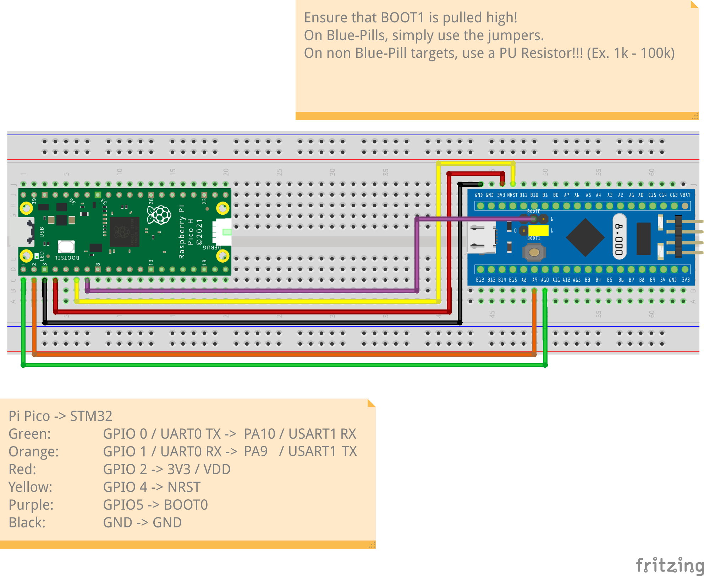
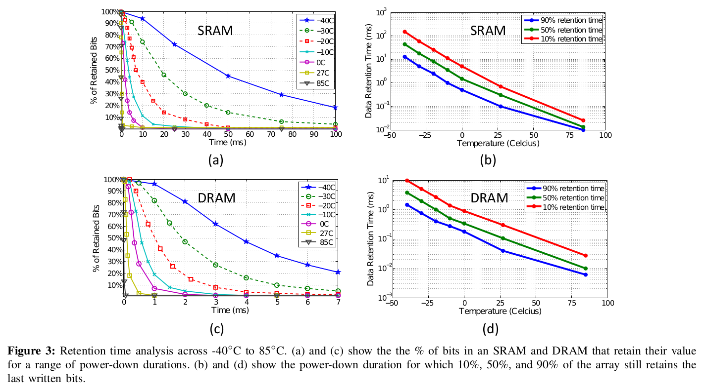
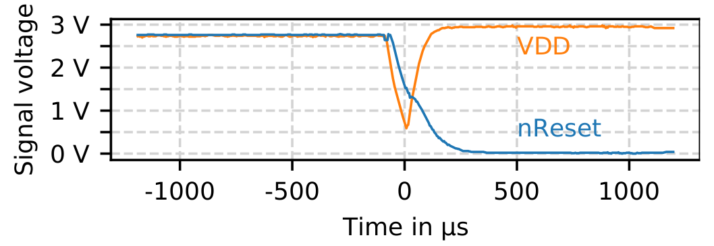

# STM32F1 Pico Pwner <!-- omit in toc -->


A Pi Pico implementation of Johannes Obermaier's, Marc Schink's and Kosma Moczek's Glitch and FPB attack to bypass RDP (read-out protection) level 1 on STM32F1 chips.

The paper describing the attack can be found [here](https://www.usenix.org/system/files/woot20-paper-obermaier.pdf) along with
its original implementation [here](https://github.com/JohannesObermaier/f103-analysis/tree/master/h3)

# Table of Contents <!-- omit in toc -->

- [Usage](#usage)
  - [What you'll need to get started](#what-youll-need-to-get-started)
  - [Pre-requisites](#pre-requisites)
  - [Cloning the repository](#cloning-the-repository)
  - [Building and flashing the attack firmware onto the Pi Pico](#building-and-flashing-the-attack-firmware-onto-the-pi-pico)
  - [Building the target board exploit firmware](#building-the-target-board-exploit-firmware)
  - [Hardware Setup](#hardware-setup)
  - [Executing the attack](#executing-the-attack)
  - [Troubleshooting](#troubleshooting)
- [How does the attack work?](#how-does-the-attack-work)
  - [Relevant STM32F1 properties](#relevant-stm32f1-properties)
    - [Read-Out Protection (RDP)](#read-out-protection-rdp)
    - [The Flash Patch and Breakpoint Unit (FPB)](#the-flash-patch-and-breakpoint-unit-fpb)
    - [SRAM](#sram)
  - [2-Stage Exploit Firmware](#2-stage-exploit-firmware)
      - [Stage 1](#stage-1)
      - [Stage 2](#stage-2)
  - [The Attack](#the-attack)
    - [Step 1: Preparation](#step-1-preparation)
    - [Step 2: Power Glitching](#step-2-power-glitching)
    - [Step 3: Exploit Firmware - Stage 1](#step-3-exploit-firmware---stage-1)
    - [Step 4: Exploit Firmware - Stage 2](#step-4-exploit-firmware---stage-2)


# Usage

## What you'll need to get started

- A PC running Linux
- A Raspberry Pi Pico (or any other RP2040 devboard)
- A debug probe (e.g. a ST-Link V2)
- An STM32F1 target board (in this repo's case a RDP locked Blue Pill is used)

## Pre-requisites

Please ensure the following dependencies are installed on your system:

- [OpenOCD](http://openocd.org/) (v0.11.0 or higher)
- [Python3](https://www.python.org/)
- [PySerial](https://pythonhosted.org/pyserial/)

Furthermore, install these additional dependencies if you intend to build the attack board and target board exploit firmware yourself:

- [Raspberry Pi Pico SDK](https://github.com/raspberrypi/pico-sdk)
- [arm-none-eabi-gcc](https://developer.arm.com/Tools%20and%20Software/GNU%20Toolchain)

The instructions also require that you have a basic understanding of how to build Pico SDK based projects. It also pre-supposes that you have a basic understanding of how to connect your Pi Pico and debug probe to your target STM32F1 board. 

## Cloning the repository

To get started, clone this repository and enter it:

```bash
$ git clone https://github.com/CTXz/stm32f1-picopwner.git
$ cd stm32f1-picopwner
```

## Building and flashing the attack firmware onto the Pi Pico

> If you wish to skip the build process and just flash the attack firmware onto your Pi Pico, you can download the latest pre-built attack firmware from the [releases page](https://github.com/CTXz/stm32f1-picopwner/releases)

Start out be entering the `attack` directory:
```bash
$ cd attack
```

Next, edit the [`CMakelists.txt`](CMakelists.txt) file to point to the location of your Pico SDK installation. For that you'll need to edit the following line:

```cmake
set(PICO_SDK_PATH "/usr/share/pico-sdk")
```

Replace `/usr/share/pico-sdk` with the path to your Pico SDK installation.

Next, create a build directory and run `cmake` and `make`:

```bash
$ mkdir build
$ cd build
$ cmake ..
$ make
```

If everything went well, you should now have a `attack.uf2` file in your build directory. Put your Pi Pico into bootloader mode and copy the `attack.uf2` file onto it.

## Building the target board exploit firmware

> If you wish to skip the build process and just flash the target board exploit firmware onto your target STM32F1 board, you can download the latest pre-built target firmware binaries from the [releases page](https://github.com/CTXz/stm32f1-picopwner/releases)

The attack relies on the target STM32F1 board getting a exploit firmware temporarily flashed onto its SRAM. This firmware contains a two-stage exploit that will dump the target board's flash memory to the serial port upon completion.

To compile the target firmware, enter the `target` directory and run `make`:

```bash
$ cd target
$ make
```

This will output multiple binaries with the name `target_nnn_usartx.bin`. The `nnn` part of the filename refers to the [SRAM entry point offset](https://github.com/CTXz/stm32f1-picopwner/issues/1#issuecomment-1603281043), and the `x` part of the filename refers to the target boards USART peripheral used to dump the flash memory contents. The dump script will automatically detect the correct SRAM entry point offset and prompt you to select a USART peripheral in order to know which binary to flash onto the target board.

Allowing to chose the USART peripheral provides the big advantage of being able to use the most convenient/accessable USART pins on the target board.

## Hardware Setup

Prior to connecting your Pi Pico to your target board, ensure that the `BOOT1` pin (typically `PB2`, but please refer to your chips datasheet) on your target board is permanently set high by using a Pull-Up resistor (1k - 100k) to 3.3V. **Neglecting to use a pull-up resistor to drive `BOOT1` high can have severe consequences, potentially damaging the pin. This is because the `BOOT1` pin is also used as a GPIO pin, and driving it as a low output without a pull-up resistor could cause a direct short.**

Next, connect your Pi Pico to your target board as shown in the table below:

| Pi Pico          | STM32F1   |
| ---------------- | --------- |
| GND              | GND       |
| ~~GPIO0 / UART0_TX~~ **NO LONGER USED**  | ~~USARTx_RX~~ **NO LONGER USED** |
| GPIO1 / UART0_RX | USARTx_TX |
| GPIO2            | VDD       |
| GPIO4            | NRST      |
| GPIO5            | BOOT0     |

Where `USARTx_TX` refers to the `TX` pin of a selected USART peripheral on the STM device, which will be utilized for transmitting the flash memory contents.

The USART TX pins for STM32F1-series chips are assigned as follows:

| USART Peripheral | TX   |
| ---------------- | ---- |
| USART1           | PA9  |
| USART2           | PA2  |
| USART3           | PB10 |

Below is a picture that shows the hardware setup using a Blue Pill board as the target board with `USART1` used to dump the flash memory:



## Executing the attack

1. Begin by connecting the Pi Pico to your PC via USB. Your Pi Pico as well as the target board should now be powered on.

> Note: Depending on the target board, it may not be obvious whether the STM32F1 is powered on or not. One way to confirm that the targeted STM32F1 is 
> receiving power is to check if the `NRST` pin is being pulled high. Another method to confirm whether the targeted STM32F1 is receiving power is to
> connect a debug probe **without** the 3.3V pin connected and check if communication through OpenOCD is possible.

> Note: If you are confident that the power-related pins are connected correctly, but the target board still does not appear to be powered on, then 
> the target board may be drawing too much current from the Pi Pico's GPIO. In this case, you will need to buffer the GPIO responsible for providing
> power (`GPIO2`) with a BJT or MOSFET.

2. Create a new terminal window in the top of this repository and run the dump script:
```bash
$ python3 dump.py -p /dev/ttyACMx -o dump.bin
```

Where `/dev/ttyACMx` is the serial port that your Pi Pico is connected to. If left unspecified, the script will attempt to use `/dev/ttyACM0` by default.
`dump.bin` is the file that the target board's flash memory will be dumped to. **If left unspecified, the script will not write the dump to a file and only
print its content to the terminal.**

> Note: If you decided to use release binaries instead of building the target firmware yourself, you will need to specify the path to the directory holding
> the target firmware binaries using the `-t` flag. By default, the script will attempt to look for the binaries in the `target/` directory of the cloned
> repository.

3. From this point on, simply follow the instructions printed by the script.

If the dump script worked, you should now have a complete dump of the target board's flash memory in the `dump.bin` file (or whatever you named it).
Please note that it is normal for the dump to contain a lot of `0xFF` bytes at the end due to unused flash typically being erased to `0xFF`.

## Troubleshooting

Should the dump script time out and fail, it could be the result of one of the following issues:
- The debug probe is still connected to the target board
- The `BOOT1` pin on the target board is not set high
- The Pi Pico has not been connected properly to the target board (Ensure the GNDs are connected!)
- The Pi Pico has not been flashed with the attack firmware
- The wrong serial port was selected (See `-p` flag)
- The wrong target USART peripheral was selected
- The power draw of the target board is too high for the Pi Pico to handle (Try buffering the power pin with a BJT or MOSFET)
- The power board has a too high capacitance on the power and/or reset pins (Try removing any power and/or reset capacitors)
- The STM32F1 board is not genuine or maybe too new (there are rumors that the exploit has been patched in 2020+ revisions of STM32F1 chips)

# How does the attack work?

## Relevant STM32F1 properties

Due to the attacks complexity, we must first introduce a couple of the STM32F1's properties that make the attack possible.

### Read-Out Protection (RDP)

Given that this whole repository is about circumventing RDP Level 1, we will skip explaining the difference between RDP Level 0, 1 and 2 (does not apply to F1 chips) and instead focus on the properties of RDP Level 1 that make the attack possible.

When RDP Level 1 is set, the device will lock down access to flash memory as soon as either of the following conditions are met:

- Condition 1: A debug probe is connected to the device
- Condition 2: The device is booted into System Memory Mode (`BOOT0` pin is set high, `BOOT1` pin is set low), aka. "Bootloader Mode"
- Condition 3: The device boots from SRAM (`BOOT0` and `BOOT1` pins are set high), starting execution at address `0x20000000`

It is important to know, that **the read-out protection lock caused by condition 1 will persist even after the debug probe is disconnected and even after a device reset has occurred!** In other words, it persists until the next power cycle after the probe has been disconnected. The read-out protection lock caused by condition 2 and 3 will only persist until the next device reset.

As we'll see later, the attack uses a glitching exploit to ridden the lock of condition 1 and then uses a 2-stage firmware exploit to get rid of the locks caused by condition 2 and 3.

### The Flash Patch and Breakpoint Unit (FPB)

The Arm Cortex-M3 (which the STM32F1 series uses) features something called the [Flash Patch and Breakpoint Unit (FPB)](https://developer.arm.com/documentation/ddi0337/h/debug/about-the-flash-patch-and-breakpoint-unit--fpb-). The FPB possesses comparators that enable the setup of "patches" which redirect execution to a specified address when a particular memory address is accessed. It is important to know that **these "patches" conveniently persist even after a device reset**. Furthermore, the FPB lacks protection, allowing it to be configured even from code executed in SRAM.

The FPB is used in the attack to trick the device into executing code from SRAM when it supposed to execute code from flash memory. More details on this will be given further below where we discuss the whole attack in detail.

### SRAM

A critical part of the attack is the ability to execute exploit code from SRAM. Unlike flash memory, the contents of SRAM are lost as soon as the device loses power. Well, see, this is not entirely true. The SRAM of the STM32F1 suffers from [data retention](https://ieeexplore.ieee.org/document/6330672) which means that the contents of SRAM will persist for a very short period of time even after the device loses power.


Example of measured data retention conducted on 6T SRAM and 3T DRAM in 65mm bulk CMOS.
[Source](https://ieeexplore.ieee.org/document/6330672)

This property of the SRAM will be exploited in the attack to preserve SRAM contents even after power cycling the STM32F1 in order to ridden the RDP lock caused by the debug probe.

## 2-Stage Exploit Firmware

The last part that needs a separate explanation is the 2-Stage exploit firmware that will be loaded into the STM32F1's SRAM. The code for the target exploit firmware can be found in the [target](target) directory.

#### Stage 1
The initial phase of the exploit firmware involves configuring the FPB (Flash Patch and Breakpoint unit) to intercept the retrieval of a reset interrupt. This is achieved by patching the reset vector fetch located at `0x00000004`, thus redirecting the execution flow to the entry point of the exploit firmware's second stage. Consequently, when the STM32F1 is reset and set to boot from flash memory, the RDP lock is effectively removed and since a reset interrupt triggers a reset fetch, the execution immediately proceeds to the second stage entry point situated in the SRAM. In short, stage one cleverly deceives the STM32F1 into executing code from the SRAM instead of its intended execution from flash memory.

#### Stage 2
By the time stage-2 has been entered, the read-out protection has been completely circumvented. The second stage of the exploit firmware simply reads and dumps the contents of the flash memory to the serial port, where it is then read by the Pi Pico and further directed to the host computer via USB.

## The Attack

With all of the above explained, we can now finally explain the attack in detail. The steps below assume the hardware setup described in the [Hardware Setup](#hardware-setup) section.

### Step 1: Preparation

During the first step, the debug probe is connected to the target STM32F1 board. This will cause condition 1 of the RDP lock to be triggered. The debug probe is then used to load the exploit firmware into SRAM and is then disconnected from the target board. Remember that condition 1 of the RDP lock will persist until the device is power cycled!

### Step 2: Power Glitching

The goal here is to get rid of the RDP lock caused by condition 1, as well as booting into SRAM. To achieve this without wiping the exploit firmware from SRAM,
we will use a power glitching attack. The attack board (Pi Pico) will first prepare `BOOT0` high and then toggle the power of the target board off. After switching the
power off, the attack board will monitor the `NRST` pin's logic state and immediately restore power once it the `NRST` pin drops low. Due to the short time it takes for
the `NRST` pin to drop low, the SRAM contents will remain preserved (due to data retention) and the STM32F1 will boot into SRAM since `BOOT0` and `BOOT1` are now both 
high. The RDP lock caused by condition 1 will also be ridden since the debug probe is not connected to the target board anymore and a power cycle has occurred.


[Source](https://www.usenix.org/system/files/woot20-paper-obermaier.pdf)

### Step 3: Exploit Firmware - Stage 1

The STM32F1 has now booted into SRAM and the exploit firmware's first stage is executed. Although we have gotten rid of the RDP lock caused by condition 1, we  are now faced with the RDP lock caused by condition 3. As already described above, the first stage of the exploit firmware will patch the reset vector fetch address to jump to the second stage of the exploit firmware. Once the patch has been applied, the attack board pulls the `BOOT0` pin low and resets the target board using the `NRST` pin. The STM32F1 will receive a reset interrupt and execute a reset vector fetch which will cause it to jump to the second stage of the exploit firmware. Simultaneously the rdp lock caused by condition 3 has been ridden since the STM32F1 believes is now booting from flash memory again (`BOOT0` is low).

### Step 4: Exploit Firmware - Stage 2

The STM32F1 is now executing the second stage of the exploit firmware. The second stage simply reads and dumps the contents of the flash memory to the serial port, where it is then read by the Pi Pico and further directed to the host computer via USB. Once the dump is complete, the exploit firmware will stop sending data to the serial port and the attack is complete.
