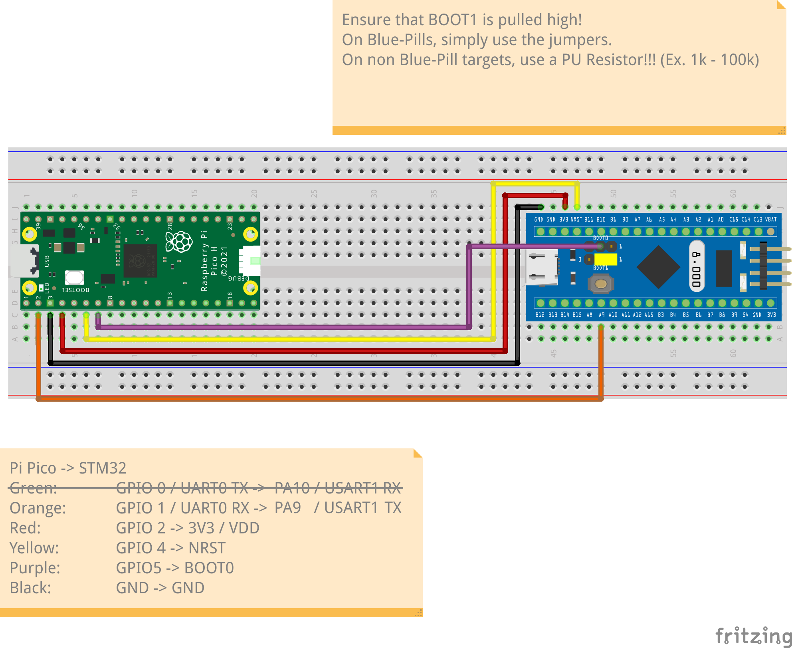

# STM32F1 Pico Pwner <!-- omit in toc -->

A Pi Pico implementation of Johannes Obermaier's, Marc Schink's and Kosma Moczek's Glitch and FPB attack to bypass RDP (read-out protection) level 1 on STM32F1 chips.

The paper describing the attack can be found [here](https://www.usenix.org/system/files/woot20-paper-obermaier.pdf) along with
its original implementation [here](https://github.com/JohannesObermaier/f103-analysis/tree/master/h3)

# Table of Contents <!-- omit in toc -->

- [Usage](#usage)
  - [What you'll need to get started](#what-youll-need-to-get-started)
  - [Pre-requisites](#pre-requisites)
  - [Building and flashing the attack firmware onto the Pi Pico](#building-and-flashing-the-attack-firmware-onto-the-pi-pico)
  - [Building the target board exploit firmware](#building-the-target-board-exploit-firmware)
  - [Hardware Setup](#hardware-setup)
  - [Executing the attack](#executing-the-attack)
- [How does the attack work?](#how-does-the-attack-work)


# Usage

## What you'll need to get started

- A PC running Linux
- A Raspberry Pi Pico
- A debug probe (e.g. a ST-Link V2)
- A STM32F1 target board (in this repo's case a Blue Pill is used)

## Pre-requisites

Please ensure the following dependencies are installed on your system:

- [OpenOCD](http://openocd.org/)
- [Python3](https://www.python.org/)
- [PySerial](https://pythonhosted.org/pyserial/)

Additionally, install the following dependencies if you intend to build the attack board and target board exploit firmware yourself:

- [Raspberry Pi Pico SDK](https://github.com/raspberrypi/pico-sdk)
- [arm-none-eabi-gcc](https://developer.arm.com/Tools%20and%20Software/GNU%20Toolchain)

The instructions also rely that you have a basic understanding of how to build Pico SDK based projects, as well as how to use a STM32F1 compatible debug probe
along with OpenOCD. It also pre-supposes that you have a basic understanding of how to connect your Pi Pico to your target STM32F1 board. 

## Building and flashing the attack firmware onto the Pi Pico

> If you wish to skip the build process and just flash the attack firmware onto your Pi Pico, you can download the pre-built `attack_v1.0.uf2` file from the [releases page](TODO)

Begin by cloning and entering this repository:

```bash
$ git clone https://github.com/CTXz/stm32f1-picopwner.git
$ cd stm32f1-picopwner
```

Next, edit the top [`CMakelists.txt`](CMakelists.txt) file to point to the location of your Pico SDK installation. For that you'll need to edit the following line:

```cmake
set(PICO_SDK_PATH "/usr/share/pico-sdk")
```

Replace `/usr/share/pico-sdk` with the path to your Pico SDK installation.

Next, create a build directory and run `cmake` and `make`:

```bash
$ mkdir build
$ cd build
$ cmake ..
$ make
```

If everything went well, you should now have a `attack.uf2` file in your build directory. Put your Pi Pico into bootloader mode and copy the `attack.uf2` file onto it.

## Building the target board exploit firmware

> If you wish to skip the build process and just flash the target board exploit firmware onto your target STM32F1 board, you can download the pre-built `targetfw.bin` file from the [releases page](TODO)

The attack relies on the target STM32F1 board getting a exploit firmware temporarily flashed onto its SRAM. This firmware contains a two-stage exploit that will dump the target board's flash memory to the serial port upon completion.

To compile the target firmware, enter the `targetfw` directory and run `make`:

```bash
$ cd targetfw
$ make
```

If everything went well, you should now have a `targetfw.bin` file in your `targetfw` directory. This file will be flashed onto the target board's SRAM during the attack.

## Hardware Setup

Prior to connecting your Pi Pico to your target board, ensure that the `BOOT1` pin (typically `PB2`, but please refer to your chips datasheet) on your target board is permanently set high by using a Pull-Up resistor (1k - 100k) to 3.3V. **Neglecting to use a pull-up resistor to drive `BOOT1` high can have severe consequences, potentially damaging the pin. This is because the BOOT1 pin is also used as a GPIO pin, and driving it as a low output without a pull-up resistor could cause a direct short.**

Next, connect your Pi Pico to your target board as shown in the table bellow:

| Pi Pico          | STM32F1   |
|------------------|-----------|
| GND              | GND       |
| GPIO0 / UART0_TX | USART1_RX |
| GPIO1 / UART0_RX | USART1_TX |
| GPIO2            | VDD       |
| GPIO4            | NRST      |
| GPIO5            | BOOT0     |

Should the USART1 pins on your target STM32F1 board be occupied, you will have to alter the target board exploit firmware to use a different USART peripheral.
This is discussed in more detail in the [How does the attack work?](#how-does-the-attack-work) section.

Bellow is a picture that shows the hardware setup using a Blue Pill board:



## Executing the attack

1. Begin by connecting connecting the Pi Pico to your PC via USB. Your Pi Pico as well as the target board should now be powered on.

> If the Pi Pico does not power on, something is either shorting or the target board is drawing too much current. If the target board draws
> too much current, you may need to buffer the power pin (GPIO2) with a BJT or a MOSFET.

1. Next, connect your debug probe (ex. ST-Link V2) to your target STM32F1 board.
2. Create a new terminal window in the top of this repository and spawn a new OpenOCD instance:

```bash
$ openocd -f interface/stlink.cfg -f target/stm32f1x.cfg
```

4. Create another terminal window in the top of this repository and create a telnet connection to the OpenOCD instance:

```bash
$ telnet localhost 4444
```

5. In the telnet session, flash the target board firmware onto the target board's SRAM:

```bash
> load_image targetfw/targetfw.bin 0x20000000
```

6. Once the target board firmware has been flashed, disconnect the debug probe from the target board. (You may also close the OpenOCD instance)

7. Create a new terminal window in the top of this repository and run the dump script:
```bash
$ python3 dump.py -p /dev/ttyACMx -o dump.bin
```

Where `/dev/ttyACMx` is the serial port that your Pi Pico is connected to. If left unspecified, the script will attempt to use `/dev/ttyACM0` by default.
`dump.bin` is the file that the target board's flash memory will be dumped to. If left unspecified, the script will not write the dump to a file but only
print it to the terminal.

8. The dump script will ask you to press any key to begin the attack. Ensure that the debug probe is really disconnected from the target board and press any key to begin the attack.
9. You should now see the target board's flash memory being dumped to the terminal. Once the dump is complete, the script will exit. This process can take a couple of minutes.

Should the dump script not output anything, the following issues could be the cause:
- The debug probe is still connected to the target board
- The Pi Pico has not been connected properly to the target board (Ensure the GNDs are connected!)
- The Pi Pico has not been flashed with the attack firmware
- The power draw of the target board is too high for the Pi Pico to handle (Try buffering the power pin with a BJT or MOSFET)
- The power board has a too high capacitance on the power and/or reset pins (Try removing any power and/or reset capacitors)
- The STM32F1 board is not genuine or maybe too new (there are rumors that the exploit has been patched in 2020+ revisions of STM32F1 chips)

If the dump script worked, you should now have a complete dump of the target board's flash memory in the `dump.bin` file (or whatever you named it).
Please note that it is normal for the dump to contain a lot of `0xFF` bytes at the end. This is because unsused flash memory is typically erased to `0xFF` bytes.

# How does the attack work?

TODO